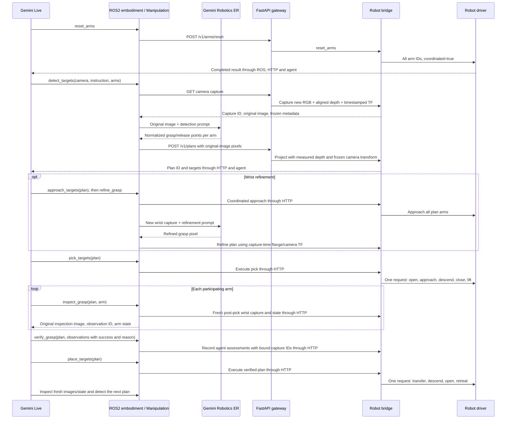

# Pixel-guided manipulation

## Execution and tool boundaries

The application still uses Gemini Live for task orchestration. Image reasoning
runs separately through Gemini Robotics ER's `generateContent` endpoint, using
`httpx`; there is no new Python SDK dependency. `--model` selects the Live model;
`--robotics-model` selects the image reasoning model (default
`gemini-robotics-er-2-preview`). Both use `GEMINI_API_KEY`.



The implementation path is `run_ros2.py` → `Ros2SessionManager` (extends `SessionManager`) → upstream
`Observation` / `DecisionMaking` / `ToolCallHandler` →
`Ros2Embodiment.execute_action` → `Manipulation` / `Ros2RobotClient` → HTTP
`api.py` → `HttpGatewayNode` → ROS service → `RobotBridgeNode` / `PixelPlans`.
`Manipulation` invokes `RoboticsER.reason` for detection and refinement only.
For grasp assessment, `inspect_grasp` captures an original inspection image and state.
The ROS2-specific `live_session.py` sends this image immediately before its tool
response, under the shared stream lock, and records delivery. The Live agent
then calls `verify_grasp` with its own assessment. Original upstream session/tool
execution code is unchanged by this feature. Tools run serially at the agent boundary; each grouped operation
contains both arms and requires coordinated execution inside the driver.

| Tool | Purpose |
|---|---|
| `reset_arms()` | Home all configured arms at normal startup |
| `recover_arms()` | Stop all arms and request payload support/release, retreat and home before a new attempt |
| `detect_targets(camera_id, instruction, arm_ids)` | Detect grasp/release points on one fixed-camera image and create a ROS2 plan |
| `approach_targets(plan_id)` | Move all selected arms to driver-defined approach/observation poses |
| `refine_grasp(plan_id, arm_id, camera_id, instruction)` | Replace one grasp point using a new wrist image after approach; retain release points |
| `pick_targets(plan_id)` | Coordinated opening, approach, descent, closing and lifting |
| `inspect_grasp(plan_id, arm_id, camera_id?)` | Send one original post-pick wrist or fixed-camera image and current stationary arm state to the Live agent; return an observation ID |
| `verify_grasp(plan_id, observations)` | Register the Live agent's per-arm `{arm_id, observation_id, success, reason}` assessments; enable placement only if all arms pass |
| `place_targets(plan_id)` | Coordinated transfer, descent, opening and retreat after verification |
| `move_arms(moves)` | Explicit coordinated metric flange poses for one or two arms |
| `get_robot_state`, `move_arm`, `set_gripper`, `stop`, `finish_task` | Existing state, manual motion, stopping and session tools |

Add a tool declaration in `agent/embodiment/ros2/tools.py`, its implementation in
`manipulation.py` (or `robot_client.py`), and dispatch in `ros2_embodiment.py`.
New HTTP/ROS operations also need an API route, a strict body in `workflow.py`,
validation in `protocol.py`, handling in `robot_node.py`, and driver support if
motion is involved. The generic `RobotRequest.srv` does not need changing for
new JSON operations. Add unit tests and a mocked-driver integration test.

## Prompts and application instructions

- `agent/embodiment/ros2/instruction.md`: the Live system instruction, followed
  by the configured arm/camera topology.
- `agent/apps/pick_and_place.md` and `dual_arm.md`: application workflows loaded
  by `--task-file`. `--instruction` supplies object and destination descriptions.
- `agent/embodiment/ros2/prompts/detect.md`, `refine.md`: separate ER prompts.
  `robotics_er.py` appends the task, selected arms and capture identity.
- Grasp assessment criteria are in the Live system instruction and `tools.py`:
  identify the intended object being held, use the current arm state as context,
  reject empty/slipping/occluded or uncertain grasps, and report a visual reason.
  There is no separate ER verification prompt or request.

The ER prompts request normalized `[y, x]` values in `0..1000`, following the
[Google Robotics ER guide](https://ai.google.dev/gemini-api/docs/generate-content/robotics-overview).
The agent converts them to integer `[x, y]` original-image pixel centers using
`round(x * (width - 1) / 1000)` and the corresponding height formula. Neither the
Live model nor ER provides depth or robot poses. ER receives the exact original
JPEG, never the resized mosaic used by Live observations. Empty, malformed,
out-of-bounds, blocked or incomplete detections do not create motion targets.

## Agent-owned grasp assessment

The Live agent already has the task and motion history. Keeping grasp assessment
in that session avoids an additional ER request per arm and lets the agent
explain its judgment in context. This is an architectural choice, not a measured
claim of higher recognition accuracy. A suitable camera image is still required; inspection falls back to a fixed
camera when no wrist camera exists.

Inspection sends one original inspection image per tool call, not the ordinary
resized mosaic. Its immediately following tool response identifies the arm,
camera, capture timestamp and observation ID. Ordinary mosaic updates are held
while inspection evidence is pending. The session waits at least one second
before each inspection frame and prevents images and responses from interleaving,
following the [Live API video input limit](https://ai.google.dev/gemini-api/docs/live-api/capabilities#sending-video).
After assessment consumes the evidence, ordinary observation resumes.

For example, after inspecting both arms, the Live agent may call:

```json
{
  "plan_id": "returned-plan-id",
  "observations": [
    {"arm_id": "left", "observation_id": "left-observation-id", "success": true,
     "reason": "The intended bar end is visible in the gripper, clear of the table."},
    {"arm_id": "right", "observation_id": "right-observation-id", "success": false,
     "reason": "The contact is occluded; I cannot establish a successful grasp."}
  ]
}
```

This assessment leaves the plan in `picked` and blocks placement. Gripper opening
is currently the available gripper telemetry; a closed gripper alone is not
proof of grasp. No force/contact sensor inference is fabricated. Use a new
inspection or stop when the evidence is insufficient.

## Capture geometry

In addition to the existing JPEG topic, each camera used by the pixel workflow
must publish the following with sensor-data QoS:

| Topic | Message | Requirement |
|---|---|---|
| `/robotics/cameras/{id}/camera_info` | `sensor_msgs/CameraInfo` | Rectified pinhole K, matching full image dimensions and optical frame; zero distortion, no cropped ROI or downsampling |
| `/robotics/cameras/{id}/depth/aligned` | `sensor_msgs/Image` | Depth aligned to RGB, identical acquisition timestamp, optical frame and dimensions; `16UC1` millimetres or `32FC1` metres |
| `/tf`, `/tf_static` | Standard TF messages | Transform from camera optical frame to world at image acquisition; additionally flange-to-world at that same time for wrist cameras |

Calibration may be published independently of each exposure, but must describe
the current image geometry. Publishers must share the ROS clock. The server
waits for a new image and matching depth/TF; it never substitutes the latest
arm-state JSON pose for a capture-time transform. Depth row stride and byte
order are respected. Zero/non-finite depth, invalid calibration or mismatched
geometry fails conversion. Missing synchronized data/TF returns 504.

For pixel `(u,v)` with measured optical-axis depth `z`, the bridge computes
`[(u-cx)*z/fx, (v-cy)*z/fy, z]`, then applies the frozen camera-to-world transform.
This is a surface/contact point, **not a flange pose**. The driver applies tool
geometry, grasp orientation, object/support offsets and approach clearances.
The same projection is used for destination support surfaces. Monocular
plane/depth estimation is not implemented; RGB-D or an upstream node supplying
registered measured depth is required. The current capture endpoint also uses
this geometry contract for verification images.

Snapshots have opaque IDs, last at most 120 seconds, and are bounded to 64
entries. Up to 32 plans are retained; detected/approached plans expire after
120 seconds. A motion invalidates other unfinished plans and pre-motion
snapshots. A plan stores its converted world points and capture provenance;
subsequent camera movement cannot change them. Source JPEGs can be evicted
without changing the converted points. Re-detect after scene changes.

## HTTP workflow and state transitions

| Method and path | JSON body / result |
|---|---|
| `GET /v1/cameras/{id}/capture` | Returns `capture_id`, `camera_id`, `width`, `height`, `stamp_ns`, `frame_id`, `camera_pose`, nullable `flange_pose`, `image_base64` |
| `POST /v1/plans` | `{capture_id, targets: [{arm_id, grasp: [x,y], release: [x,y]}]}` |
| `POST /v1/plans/refine` | `{plan_id, arm_id, capture_id, pixel: [x,y]}` |
| `POST /v1/plans/execute` | `{plan_id, stage: "approach" | "pick" | "place"}` |
| `POST /v1/plans/verify` | `{plan_id, observations: [{arm_id, capture_id, success: boolean}]}` |
| `POST /v1/arms/reset` | No arguments; all configured arms |
| `POST /v1/arms/poses` | `{moves: [{arm_id, frame_id, position, orientation, duration?}]}` |

Plan responses include `success`, `plan_id`, `state`, and per-arm `targets` with
`grasp`/`release` fields containing `frame_id`, `position`, `capture_id`, `pixel`
and `stamp_ns`. Completed stages also include `motion_stamp_ns`.

States are `detected → approached (optional) → picked → verified → placed`.
Refinement is allowed only after approach and only from that arm's newer wrist
image. Verification must cover every selected arm using fixed-camera or matching wrist images acquired
**after pick completion**. A false visual result retains `picked`, so placement
remains blocked; inspect again or stop. Verification is supplied by the trusted
Live agent, not cryptographically attested. The agent submits an observation ID
that must match the plan and arm, and whose image has actually been sent to its
session. Unsent or invalidated observations and duplicate/missing arms are
rejected before HTTP submission. Evidence is consumed on submission, even on
failure; changing a failed judgment requires new inspection images. Reasons
are included in the tool result/log; the unchanged server verification endpoint
receives bound capture IDs and booleans. A placed or interrupted plan cannot be replayed.
The bridge admits one motion at a time, with stop and observation still available.
Reset, stop and manual motions invalidate unfinished plans. Unknown outcomes
require a successful stop of **all** arms and driver recovery before another attempt;
a stop of one arm does not resolve uncertainty about its peer.

## Coordinated driver contract

The bridge sends one `RobotRequest` to `/robot_driver/execute` for each grouped
operation. The driver must support:

- `reset_arms`: payload `{arm_ids, coordinated: true}`. Home all specified arms.
- `move_arms`: payload `{moves, arm_ids, coordinated: true}`. Plan a common
  trajectory and completion barrier for all requested flange poses.
- `execute_plan`: payload `{plan_id, stage, targets, phases, coordinated: true}`.
  `targets` contains all participating arms and their measured world contact
  points. `approach` uses `["approach"]`; `pick` uses
  `["open", "approach", "descend", "close", "lift"]`; `place` uses
  `["transfer", "descend", "open", "retreat"]`.

Preflight the entire group before moving any arm. Synchronize every phase and
barrier across both arms, including gripper closing, lifting and release. For
shared objects, preserve the relative grasp constraint throughout transfer.
Do not implement this contract as two unrelated sequential arm commands. If a
member fails, stop the group; do not continue its peer's remaining phases.

Return HTTP-style status 200 with
`{"success": true, "coordinated": true, "completed_arm_ids": ["left", "right"]}`
only after all phases finish. Every requested arm must appear exactly once.
A plain `success: true` or a 202 acceptance is insufficient. Partial/failing
execution must report failure, with `outcome: "unknown"` when appropriate.
The bridge never retries motion, invalidates the plan on failure, and rejects
new commands after unknown completion until all arms are stopped and recovered. Stage/reset/
group-move requests have a 60-second ROS deadline and 65-second HTTP client
budget. Stopping physical motion is the driver's responsibility even if the
ROS service future times out or is cancelled.

This repository implements capture/projection, orchestration, requests and
completion validation. It intentionally does not include a hardware controller,
MoveIt planning, robot-specific home/grasp poses, force control or realtime
synchronization. Those belong to the existing driver integration boundary.

## Validation

Unit tests cover normalized coordinate conversion, ER request/response handling,
measured depth projection, transform rotation, stride/endianness, stale captures
and invalid input. Integration tests publish actual ROS2 RGB-D and TF messages,
exercise HTTP/services, and replace only the physical driver and Gemini calls.
They cover moving wrist transforms, optional refinement, failed/stale grasp
verification, group acknowledgement, stop/timeouts, replay rejection, coordinated
metric motion, and a complete Live/ER dual-arm workflow over two task cycles.
They also assert exact original-image delivery before inspection responses,
that grasp assessment never calls ER, and that undelivered/incorrect evidence
or a failed agent assessment cannot enable placement. These tests do not establish
physical synchronization or comparative accuracy of the Live and ER models.

See [tool lifecycle](tool-lifecycle.md) for exact triggers, supported camera
selection, fault telemetry, the recovery operation, retry limits and external
ER prompt customization. Stopping after a failed manipulation does not clear
the recovery requirement: successful driver recovery is needed before retrying.
